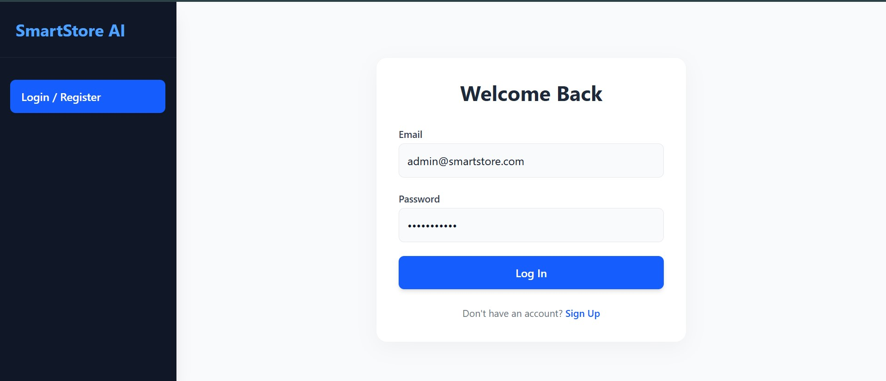
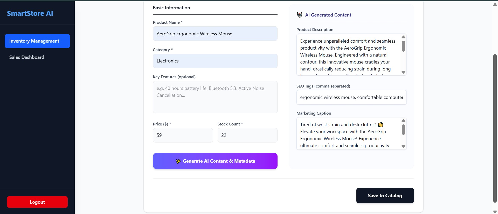
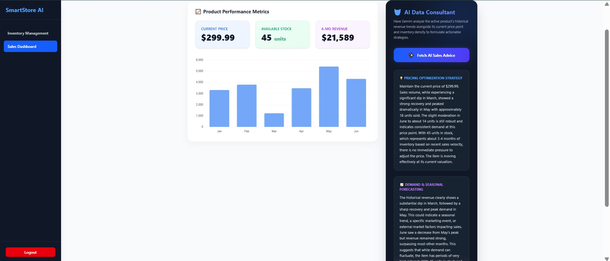

+--------------------------------------------------------+
   |               React Front-End (Vite)                   |
   |  - Tailwind CSS Responsive Workspace Layout UI         |
   |  - Localized JWT Session State & Context Providers     |
   +--------------------------------------------------------+
                           |
                           | (Secure HTTP / RESTful API Requests)
                           v
   +--------------------------------------------------------+
   |             Node.js / Express Backend                  |
   |  - Token-Based Auth Middleware Isolation Block         |
   |  - Modular Routing Architecture Component Controllers  |
   +--------------------------------------------------------+
          |                                          |
          | (Mongoose ORM Driver)                    | (Google Gen AI SDK)
          v                                          v
+---------------------------+              +---------------------------+
|    MongoDB Atlas Cloud    |              |   Google DeepMind Engine  |
| - Secure Collections      |              | - Real-time JSON Outputs  |
| - Cluster Data Storage    |              | - Gemini-2.5-Pro / Flash  |
+---------------------------+              +---------------------------+


### Key Functional Data Flows:
1. **Metadata Acceleration Pipeline:** User inputs a raw `Name`, `Category`, and `Key Features` inside the client application. The request travels through the protected backend gateway to the Google DeepMind compiler, which strips out formatting and structures transactional JSON containing e-commerce descriptions, exact 5-key SEO tags arrays, and a high-conversion social media caption.
2. **Predictive Intelligence Loop:** Product sales and revenue matrices are analyzed natively in the database and structured into historical trends. The analytical router parses these metrics through the generative intelligence model to extract tailored dynamic pricing matrices and demand forecasts.

---

## 📊 Database Schema Blueprint

The data layer is hosted on a MongoDB Atlas `M0` Cluster using native Mongoose Document Schemas. It features optimized relationship trees linking administrative identities with structured product catalogs.

### 1. User Model Schema (`Collection: users`)
| Field Name | Data Type | Validation / Index | Description |
| :--- | :--- | :--- | :--- |
| `_id` | ObjectId | Primary Key (Auto) | Unique system token for identity mapping |
| `username` | String | Required, Trimmed | Unique display identity for administrative panel |
| `email` | String | Required, Unique, Trimmed | Primary communication address and validation flag |
| `password` | String | Required | Secure 12-round Bcrypt salted hash signature |
| `createdAt`| Date | Default: Date.now() | Automatic date tracker for profile initialization |

### 2. Product Model Schema (`Collection: products`)
| Field Name | Data Type | Validation / Index | Description |
| :--- | :--- | :--- | :--- |
| `_id` | ObjectId | Primary Key (Auto) | Unique item identifier in the inventory stack |
| `name` | String | Required, Trimmed | Commercial listing title |
| `category` | String | Required, Index | Structural grouping for catalog organization |
| `features` | String | Optional | Raw input specifications utilized by the AI engine |
| `price` | Number | Required, Min: 0 | Listing currency price value |
| `stock` | Number | Required, Min: 0 | Live inventory tracking metric |
| `description`| String | AI Generated | Comprehensive sales copy |
| `tags` | Array [String]| AI Generated | String array of exactly 5 search optimization keys |
| `caption` | String | AI Generated | Platform marketing caption incorporating emoji arrays |
| `revenue` | Array [Number]| Default Sample Array | Multi-month historical cash revenue metrics |

---

## 🛠️ Technological Stack Matrix

### Frontend Ecosystem
- **Core Library:** React.js (v18+) compiled natively via the **Vite** bundler engine.
- **Styling Architecture:** Tailwind CSS utility-first framework using modern flexbox grids, sticky layout wrappers, and transition micro-interactions.
- **State Hydration:** React Context Providers combined with local state management hooks to maintain secure JSON Web Tokens (JWT) persistently across browser session cycles.

### Backend Infrastructure
- **Runtime Environment:** Node.js long-term-support architecture.
- **Server Application Framework:** Express.js processing clean REST routing modules.
- **Database Modality:** MongoDB Atlas Cloud Node Configuration using **Mongoose Object Data Modeling (ODM)**.
- **Security & Authorization Framework:** JSON Web Tokens (`jsonwebtoken` signature validation) backed by 12-round `bcryptjs` password hashing middleware.
- **Generative AI Link Layer:** Modern `@google/genai` production SDK linking directly into Google DeepMind’s specialized `gemini-2.5-pro` and `gemini-2.0-flash` endpoints.

---

## 🚀 Native Deployment & Installation Manual

Ensure you have Node.js (v18 or higher) and npm installed locally on your operating system prior to execution.

### 1. Repository Core Separation
Clone the master branch layout cleanly into your workspace and change directory into the root layer:
```bash
git clone [https://github.com/YOUR_USERNAME/SmartStoreAI.git](https://github.com/YOUR_USERNAME/SmartStoreAI.git)
cd SmartStoreAI
2. Backend Environment Hydration & Bootstrapping
Navigate directly into the service engine directory and configure the environment system variables:

Bash
cd backend
npm install
Create a new file named .env right inside the /backend folder and populate it with your localized configuration blocks:

Plaintext
PORT=5000
MONGO_URI=mongodb+srv://<username>:<password>@cluster0.zaif2pg.mongodb.net/smartstore?appName=Cluster0
JWT_SECRET=your_custom_jwt_signing_token_phrase
GOOGLE_API_KEY=AIzaSyYourCleanUncompromisedGoogleStudioApiKey
Initialize your production cloud database clusters by triggering the batch data insertion compiler script:

Bash
node seed.js
Expected Terminal Print: MongoDB Connected: ... followed by Data Imported successfully!

Launch the persistent application service:

Bash
npm run dev
3. Frontend Presentation Assembly
Open a secondary independent terminal terminal split, position yourself into the workspace user-interface directory, and launch the presentation server:

Bash
cd ../frontend
npm install
npm run dev
Open your browser engine directly to http://localhost:5173/ to view the app.

📷 Production Application Walkthrough
This section provides dedicated placeholders for project assignment submissions and visual asset embedding.

🛠️ UI Component Showcase & Workspaces
1. Identity Gate & Authentication Firewall
Provides security protection isolation across administrative routes using fully interactive forms tracking live error interception.


Visual Reference: Render your pristine Tailwind UI authentication card indicating active state hooks.

2. AI Metadata Inventory Workspace
The algorithmic core of the suite. Enter basic information and fire the AI pipeline to observe synchronized UI field auto-population.


Visual Reference: Highlight your dual-column workspace layout showing standard inputs on the left side and Gemini-generated marketing results on the right.

3. Sales Intelligence Dashboard
Renders complex numerical inventory histories matched against high-level business consultation strings.


